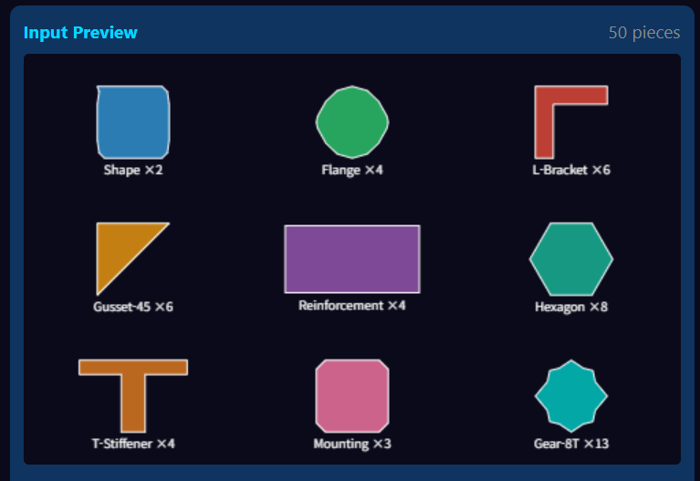
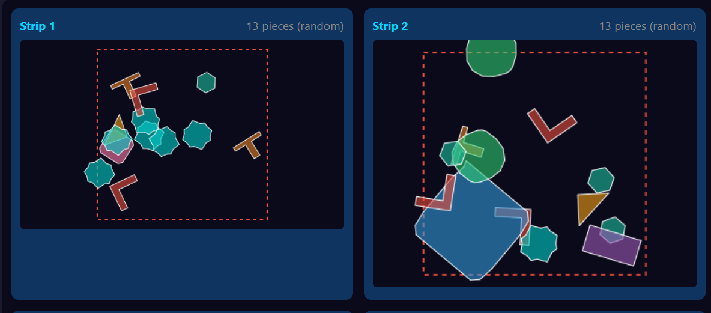
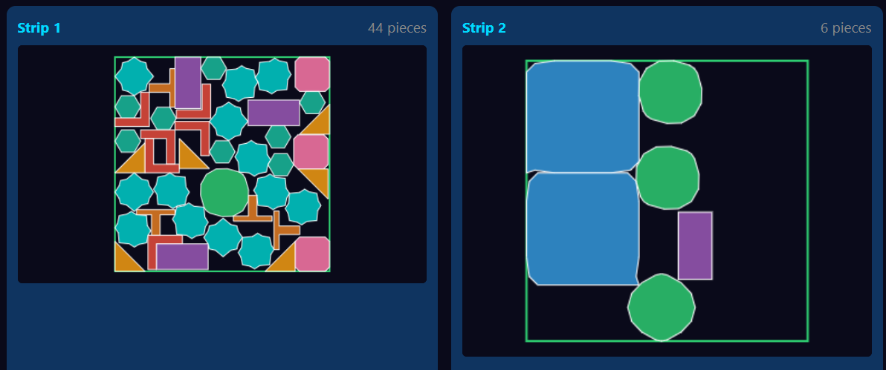
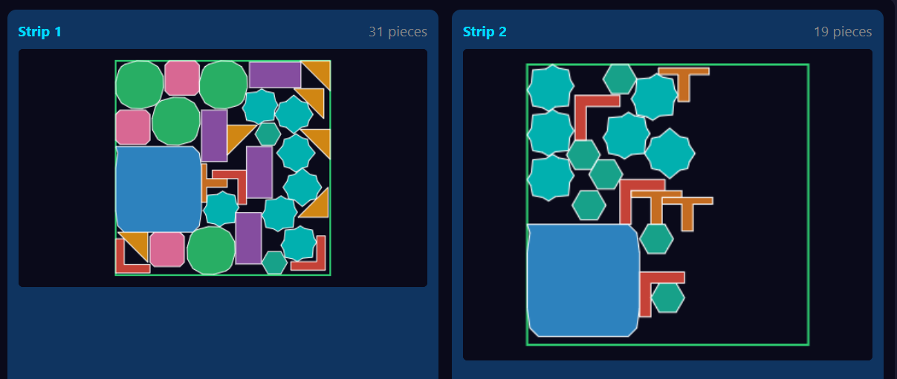
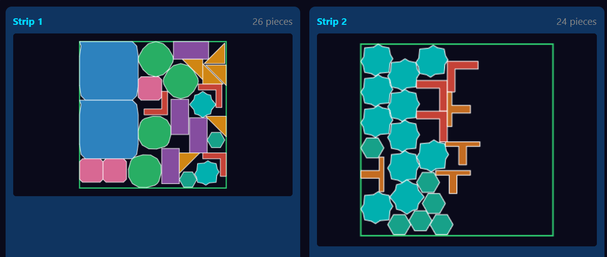
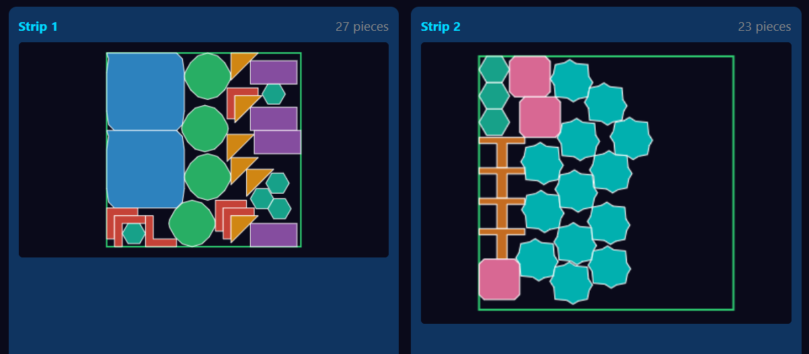
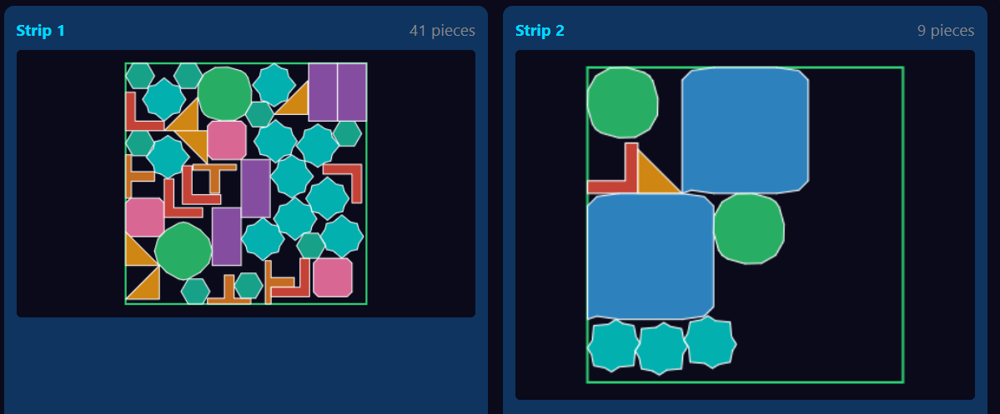
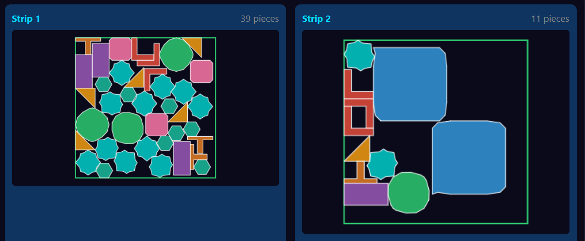
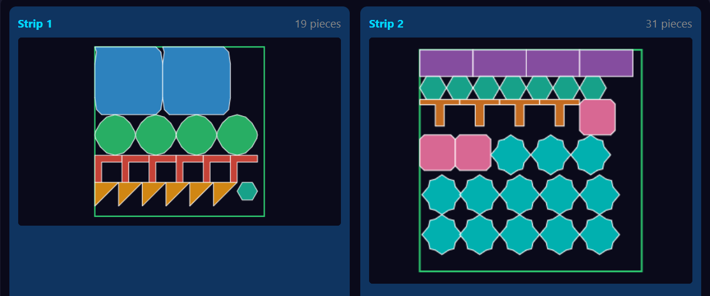

# U-Nesting

**2D/3D Spatial Optimization Engine** - High-performance nesting and bin packing algorithms in Rust with C FFI support

[](https://crates.io/crates/u-nesting)
[](https://docs.rs/u-nesting)
[](https://github.com/iyulab/U-Nesting/actions)
[](LICENSE-MIT)
[](https://www.rust-lang.org/)

<p align="center">
  
</p>

## Overview

U-Nesting provides domain-agnostic spatial optimization algorithms for 2D nesting and 3D bin packing problems:

- **2D Nesting** - Optimal polygon placement on bounded surfaces
- **3D Bin Packing** - Optimal volume arrangement in containers
- **Genetic Algorithm** - Metaheuristic optimization for complex layouts
- **NFP/NFR Computation** - Precise collision-free placement

### Design Philosophy

U-Nesting is a **pure computation engine** with no domain-specific logic. Industry context (manufacturing, textile, logistics, etc.) is determined by consuming applications.

```
┌─────────────────────────────────────────┐
│         Consuming Applications          │
│  (Manufacturing, Textile, Logistics)    │
└─────────────────┬───────────────────────┘
                  │ Domain Context
                  ▼
┌─────────────────────────────────────────┐
│            U-Nesting Engine             │
│   Pure Geometry + Optimization Math     │
│      (Domain Agnostic)                  │
└─────────────────────────────────────────┘
```

## Features

- 🚀 **High Performance** - Written in Rust with parallel computation via Rayon
- 🎯 **Domain Agnostic** - Abstract models adaptable to any spatial optimization
- 📐 **2D Support** - Polygon nesting with NFP, holes, and curves
- 📦 **3D Support** - Box and mesh packing with physical constraints
- 🔌 **C FFI Support** - Use from C#, Python, or any language with C bindings
- 📦 **Zero Domain Dependencies** - Pure mathematical optimization

## Demo

### Sample Dataset

A test dataset with **9 different polygon shapes** and **50 total pieces** on a 500×500 boundary:

<p align="center">
  
  
</p>

<p align="center">
  <em>Left: Original shapes | Right: Randomized input order</em>
</p>

### Algorithm Comparison

Optimization results using different algorithms on the same dataset (50 pieces, 500×500 boundary, 2 strips):

| Algorithm | Result | Utilization | Time |
|-----------|--------|-------------|------|
| **GA** (Genetic Algorithm) |  | **70.6%** | 19.5s |
| **GDRR** (Goal-Driven Ruin & Recreate) |  | 69.4% | 30.5s |
| **ALNS** (Adaptive Large Neighborhood Search) |  | 69.1% | 30.2s |
| **NFP** (No-Fit Polygon Guided) |  | 68.5% | 5.0s |
| **BRKGA** (Biased Random-Key GA) |  | 67.8% | 23.5s |
| **SA** (Simulated Annealing) |  | 64.1% | 34.3s |
| **BLF** (Bottom-Left Fill) |  | 60.0% | 338ms |

> **Note**: Higher utilization = better material efficiency. Results may vary depending on piece shapes, quantities, and constraints. Run your own benchmarks to find the best algorithm for your specific use case.

## Installation

### From crates.io

```toml
[dependencies]
u-nesting = "0.1"                              # 2D only (default)
u-nesting = { version = "0.1", features = ["3d"] }  # 2D + 3D
```

### From GitHub

```toml
[dependencies]
u-nesting = { git = "https://github.com/iyulab/U-Nesting" }
```

## Quick Start

### 2D Nesting

```rust
use u_nesting::d2::{Geometry2D, Boundary2D, Nester2D, Config2D};

// Define geometries to place
let geometries = vec![
    Geometry2D::new("G1")
        .with_polygon(polygon![(0,0), (100,0), (100,50), (0,50)])
        .with_quantity(5)
        .with_rotations(vec![0.0, 90.0, 180.0, 270.0]),
];

// Define boundary
let boundary = Boundary2D::rectangle(1000.0, 500.0);

// Configure and run
let config = Config2D::default()
    .with_spacing(3.0)
    .with_margin(10.0);

let result = Nester2D::new(config).solve(&geometries, &boundary);
println!("Utilization: {:.1}%", result.utilization * 100.0);
```

### 3D Bin Packing

```rust
use u_nesting::d3::{Geometry3D, Boundary3D, Packer3D, Config3D};

// Define geometries to place
let geometries = vec![
    Geometry3D::box_shape("G1", 30.0, 20.0, 15.0)
        .with_quantity(10)
        .with_mass(2.5),
];

// Define boundary
let boundary = Boundary3D::box_shape(120.0, 80.0, 100.0)
    .with_max_mass(500.0);

// Configure and run
let config = Config3D::default()
    .with_gravity(true)
    .with_stability(true);

let result = Packer3D::new(config).solve(&geometries, &boundary);
println!("Utilization: {:.1}%", result.utilization * 100.0);
```

## Core Concepts

| Concept | Description | 2D | 3D |
|---------|-------------|----|----|
| **Geometry** | Shape to be placed | Polygon | Box, Mesh |
| **Boundary** | Containing region | Rectangle, Polygon | Box, Cylinder |
| **Placement** | Position + orientation | x, y, θ | x, y, z, rotation |
| **Spacing** | Gap between geometries | Float | Float |
| **Margin** | Offset from boundary edge | Float | Float |
| **Constraint** | Placement rules | Rotation, Direction | Orientation, Stability |

## Module Structure

```
u-nesting/
├── core/           # Shared abstractions
│   ├── traits.rs   # Geometry, Boundary, Solver
│   ├── ga.rs       # Genetic algorithm framework
│   ├── config.rs   # Common configuration
│   └── result.rs   # Unified result types
│
├── d2/             # 2D Module
│   ├── geometry.rs # Polygon, Point, Segment
│   ├── boundary.rs # 2D boundary definitions
│   ├── nfp.rs      # No Fit Polygon
│   ├── nester.rs   # Placement algorithms
│   └── io.rs       # Import/Export
│
├── d3/             # 3D Module
│   ├── geometry.rs # Box, Mesh, AABB
│   ├── boundary.rs # 3D boundary definitions
│   ├── nfr.rs      # No Fit Region
│   ├── packer.rs   # Placement algorithms
│   ├── physics.rs  # Gravity, stability
│   └── io.rs       # Import/Export
│
└── ffi/            # C FFI interface
```

## Algorithms

### 2D Algorithms

| Algorithm | Description | Quality | Speed |
|-----------|-------------|---------|-------|
| **BLF** (Bottom-Left Fill) | Greedy placement at bottom-left positions | ★★★☆☆ | ★★★★★ |
| **NFP** (No-Fit Polygon Guided) | NFP-based collision-free placement | ★★★★☆ | ★★★☆☆ |
| **GA** (Genetic Algorithm) | Sequence optimization with crossover/mutation | ★★★★★ | ★★☆☆☆ |
| **BRKGA** (Biased Random-Key GA) | Random-key encoding with elite inheritance | ★★★★★ | ★★☆☆☆ |
| **SA** (Simulated Annealing) | Temperature-based neighborhood search | ★★★★☆ | ★★★☆☆ |
| **GDRR** (Greedy Descent with Random Restarts) | Local search with restart diversification | ★★★★☆ | ★★★☆☆ |
| **ALNS** (Adaptive Large Neighborhood Search) | Destroy-repair with operator selection | ★★★★★ | ★★☆☆☆ |

### 3D Algorithms

| Algorithm | Description | Quality | Speed |
|-----------|-------------|---------|-------|
| **Extreme Point** | Placement at extreme points | ★★★☆☆ | ★★★★★ |
| **Layer Packing** | Layer-based bottom-up placement | ★★★☆☆ | ★★★★☆ |
| **Genetic Algorithm** | Sequence and rotation optimization | ★★★★★ | ★★☆☆☆ |

## Configuration

### 2D Configuration

```rust
let config = Config2D {
    // Spacing
    spacing: 3.0,            // Gap between geometries
    margin: 10.0,            // Boundary edge offset
    
    // Rotation
    rotation_steps: 4,       // Number of rotation angles
    allow_flip: false,       // Allow mirroring
    
    // Optimization
    strategy: Strategy::GA,
    time_limit_ms: 30000,
    target_utilization: 0.90,
};
```

### 3D Configuration

```rust
let config = Config3D {
    // Spacing
    spacing: 0.0,            // Gap between geometries
    margin: 5.0,             // Boundary wall offset
    
    // Physics
    gravity: true,
    stability: true,
    max_mass: None,
    
    // Orientation
    orientations: OrientationSet::AXIS_ALIGNED,
    
    // Optimization
    strategy: Strategy::ExtremePoint,
    time_limit_ms: 30000,
};
```

## FFI Interface

### JSON Request (2D)

```json
{
  "mode": "2d",
  "geometries": [
    {
      "id": "G1",
      "polygon": [[0,0], [100,0], [100,50], [0,50]],
      "quantity": 5,
      "rotations": [0, 90, 180, 270]
    }
  ],
  "boundary": { "width": 1000, "height": 500 },
  "config": { "spacing": 3.0, "strategy": "ga" }
}
```

### JSON Request (3D)

```json
{
  "mode": "3d",
  "geometries": [
    {
      "id": "G1",
      "dimensions": [30, 20, 15],
      "quantity": 10,
      "mass": 2.5
    }
  ],
  "boundary": { "dimensions": [120, 80, 100], "max_mass": 500 },
  "config": { "gravity": true, "stability": true }
}
```

### C Interface

```c
extern int unesting_solve(const char* request_json, char** result_ptr);
extern void unesting_free_string(char* ptr);
```

```csharp
// C# example
[LibraryImport("u_nesting")]
public static partial int unesting_solve(string request, out IntPtr result);
```

## Result Structure

```rust
SolveResult {
    placements: Vec<Placement>,   // Position + orientation for each geometry
    boundaries_used: usize,       // Number of boundaries needed
    utilization: f64,             // Area/volume efficiency (0.0 - 1.0)
    unplaced: Vec<String>,        // IDs of geometries that couldn't fit
    computation_time_ms: u64,
}
```

## Performance

### 2D Benchmarks (GA, 500 generations)

| Geometries | Complexity | Time | Utilization |
|------------|------------|------|-------------|
| 20 | Simple | 200ms | 92% |
| 100 | Mixed | 2s | 88% |
| 500 | Complex | 15s | 85% |

### 3D Benchmarks (Extreme Point)

| Geometries | Complexity | Time | Utilization |
|------------|------------|------|-------------|
| 50 | Uniform | 100ms | 85% |
| 200 | Mixed | 1.5s | 78% |
| 100 | Constrained | 3s | 72% |

## Architecture

```
┌──────────────────────────────────────────────┐
│              U-Nesting Engine                │
├──────────────────────────────────────────────┤
│  Core: Traits, GA Framework, Config          │
├─────────────────────┬────────────────────────┤
│     2D Module       │       3D Module        │
├─────────────────────┼────────────────────────┤
│  Polygon, NFP       │  Box, Mesh, NFR        │
│  BLF, GA Nester     │  EP, LAFF, GA Packer   │
└─────────────────────┴────────────────────────┘
          ▲                    ▲
          │                    │
┌─────────┴────────────────────┴───────────────┐
│           Consuming Applications             │
│  ┌─────────┐ ┌─────────┐ ┌─────────┐        │
│  │  Sheet  │ │  Mold   │ │Container│  ...   │
│  │  Metal  │ │  Design │ │ Loading │        │
│  └─────────┘ └─────────┘ └─────────┘        │
└──────────────────────────────────────────────┘
```

## License

Licensed under either of:

- MIT license ([LICENSE-MIT](LICENSE))

## Contributing

Contributions are welcome! Please read [CONTRIBUTING.md](CONTRIBUTING.md) for guidelines.

## Related

- [u-numerics](https://github.com/iyulab/u-numerics) — Mathematical primitives
- [u-metaheur](https://github.com/iyulab/u-metaheur) — Metaheuristic optimization (GA, SA, ALNS, CP)
- [u-geometry](https://github.com/iyulab/u-geometry) — Computational geometry
- [u-schedule](https://github.com/iyulab/u-schedule) — Scheduling framework